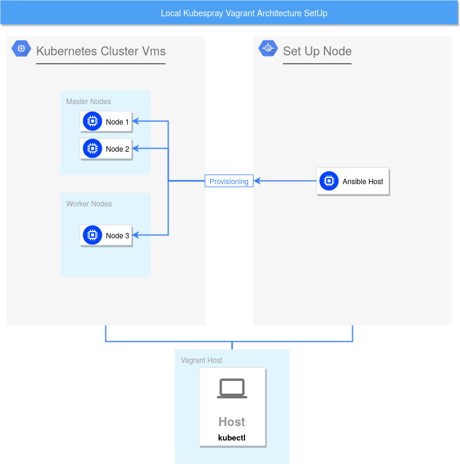

# Kubernetes Playground
This is a simple kubernetes playground, based on my `kubespray-test` environment, which can be found [here](https://github.com/zwoefler/Testing-Environments/tree/master/kubespray-test).
Once set up, the Playground contains 4 VMs, three of which run the Kubernetes cluster and one machine functions as the Host, form which you can run all your Kubernetes commands.


# Goal
This repository aims to provide a simple, local Kubernetes Cluster to play around with, without any installation or setup effort!

### Requirements
Your minimal specs, to run this environment should be as follows

| Component | Amount |
| --- | --- |
| RAM | 12GB |


# Architecture
The architexture can be seen in the image below.


This environment consists of your `Host`, an `ansible-host` (VM) and some `nodes` VM to run the Kubernetes Cluster.
The `ansible-host` s being used, to run `Kubespray` and serves as an external Load Balancer. This is, so you don't need to have Ansible, nor Kubernetes installed on your host.

In the following document, your local machine ist refered to as `Host`, the machine running Ansible, Kubernetes and setting up the Cluster is refered to by `ansible-host` and every other Node is referenced as `nodeX`, with `X` being a number.


### Machines
The setup consists of four machines:
- 1 Ansible Host - runs Ansible and deploys the cluster to the working nodes
- 3 VMs - These `nodes` actually run the kubernetes cluster.

From the Ansible host you can reach every machine via SSH. Below, you find a list of the machines IP addresses:

| VM | IP |
| --- | --- |
| Ansible Host | 192.168.33.10 |
| Node1 | 192.168.33.20 |
| Node2 | 192.168.33.30 |
| Node3 | 192.168.33.40 |


### Users
Each machine has the user `root` and `vagrant`. The SSH keys are set up, so you don't need a password to enter the machines. In case you do, the passwords are listed below:

| User | Password |
| --- | --- |
| root | root |
| vagrant | vagrant |


# How to use it?

## Prerequisites
#### VM Provider
THis example uses Vagrant to provide the Virtual Machines, but any other
Provider should be fine.
In case you want to follow this repository in the intentioned way, install Virtual Box.
Should you prefer to use an alternative, Create 4 VMs, provision one of the machines with the `setup-ansible-host.yml` playbook, and the remaining machines with the `setup-worker-node.yml` playbook.

On Ubuntu install VirtualBox via:

`sudo apt install virtual-box`

#### Vagrant
To run a cluster locally, on your machine, you need vagrant, to setup VMs easily, with the included `Vagrantfile`.

On Ubuntu install Vagrant via:

`sudo apt install vagrant`


## Set Up
#### Initial SetUp
These steps are performed on your `Host`.

1. Install the [prerequisites](#Prerequisites)
2. Clone this repository via git clone: `git clone git@github.com:zwoefler/Testing-Environments.git`
3. Change Directory into kubernetes-playground: `cd Testing-Environments/kubernetes-playground`
4. Run the Vagrantfile: `vagrant up`. It can take some time (several minutes) to create the machines and provisioning with ansible.

With the commands above, you now should have 4 machines up and running on your `Host`.
All machines are already provisioned with set up SSH-Keys, Python3, kubespray and, the best of all, a running kubernetes cluster.
You can now SSH into each machine, using the IPs which you can see in the console output. Further information can be found in the [Machines](#machines) section.

Continue Reading the [Using Kubernetes](#using-kubernetes) section.
Run `vagrant status` and you should see an output, similar to the following table:

Current machine states:

ansible-host              powerd on (virtualbox)
node1                     powerd on (virtualbox)
node2                     powerd on (virtualbox)
node3                     powerd on (virtualbox)


6. Last but not least, run the Ansible playbook that creates your kubernetes cluster via:
`ansible-playbook -i inventory/mycluster/hosts.yaml  --become --become-user=root cluster.yml`.
Be warned, this step might take 20 minutes or more!

Finishing this step, you now have a running Kubernetes Cluster on several virtual machines. Congratulations!
To use your cluster productivly, install `kubectl` on your `Host`. More information is found in the [next section](#use-your-cluster).


## Upgrade Kubernetes Version
Once your cluster is up and running, you maybe want to update the kubernetes version that is used. You can do this very easily with the following steps. On the `ansible-host` machine we will make some changes.

1. So first, login to your ansible-host:
`vagrant ssh ansible-host`

2. Change into the kubespray directory:
`cd kubespray`

3. Edit the variables used for the cluster. Here we use VIM to change our files:
`vim inventory/mycluster/group_vars/k8s-cluster/k8s-cluster.yml`

4. In the opened document, search for `kube_version` by typing `/kube_version` in vim and hit enter. Pressing `n` will cycle through the selected and found words.

5. Once you found `kube_version` change it to your desired version and save the file by pressing `ESC` --> `:wq`

6. Now run the `upgrade-cluster` playbook via:
`ansible-playbook -i inventory/mycluster/hosts.yaml --user root upgrade-cluster.yml`


### Example
1. Run two nginx container: `kubectl run nginx --image nginx --replicas 2`
2. `watch -x kubectl get nodes,pods -o wide`
3. Run the steps from [#upgrade-kubernetes-version]
You will see that nodes are getting shut down and recreated. Kubespray is taking care of all the upgrading process and managing the two nginx containers that we set up.


## Adding and Removing Nodes
To actually see what happens, I advise you to run the watch command on `kubectl get nodes` in a seperate terminal.

`watch -x kubectl get nodes`

Either adding or removing a node, reqires you to be logged into the `ansible-host` via
`vagrant ssh ansible-host` and change directory into `kubespray`: `cd kubespray`.

## WORK IN PROGRESS
### Adding a node
Within the `kubespray` directory we now need to edit the `hosts.yml`, used by Kubespray, to setup your nodes.
In this example, we will add a fourth node named `node4` to the cluster.

1. Edit the inventory file. We will open it with VIM:
`vim inventory/mycluster/hosts.yaml`

2. WIthin the `hosts.yml`, add a node to the `all: hosts:` section, and provides its IP address.
    ```
    node4:
      ansible_host: 192.168.33.50
      ip: 192.168.33.50
      access_ip: 192.168.33.50
    ```
3. The previously created node `Node4` now must be added to one of the children-groups. If you want to add `Node4` as a worker node, add it to `kube-node` group, like so:

```
[...]

children:
    kube-master:
      hosts:
        node1:
        node2:
    kube-node:
      hosts:
        node1:
        node2:
        node3:
        node4:

[...]
```

5. Save your changes (`:wq`) and run the ansible playbook `scale.yml` with the now changed `hosts.yml`: `ansible-playbook -i inventory/mycluster/hosts.yaml --user root scale.yml`

You have successfully added a fourth node to your cluster, which is production ready.


## ToDos


- Implement a way, to vary the amount of nodes
    - Automatically adjust the amount of nodes, to the systems resources

- Create roles out of the spaghetti playbooks!

- Parallize the Provisioning process of the VMs

- [ ] Output the IP addresses of the VMs with their corresponding nodes

- [ ] Add a machine, provision it and use it as an additional node - Automatically:
    - [ ] Script to add Vagrant machine
    - [ ] Provision the machine
        - [ ] SSH keys
        - [ ] Software
        - [ ] Users
        - [ ] ...
    - [ ] Automate the adding a node to the cluster [#adding-and-removing-nodes]

- [ ] Automated README script
    - [ ] List of hosts in File - Building the tables for the machines automatically
    - [ ] Put IP-addresses into the the commands
    - [ ] Automated Table of Contents


#### Kubernetes
Once the VM setup is done, you will need kubernetes kubectl to control your Kubernetes cluster.


Install Kubernetes kubectl binary with curl:

1. Download the latest release with the command:

    ```curl -LO https://storage.googleapis.com/kubernetes-release/release/`curl -s https://storage.googleapis.com/kubernetes-release/release/stable.txt`/bin/linux/amd64/kubectl```


    To download a specific version, replace the ```
    $(curl -s https://storage.googleapis.com/kubernetes-release/release/stable.txt)``` portion of the command with the specific version.

    For example, to download version v1.17.0 on Linux, type:

    `curl -LO https://storage.googleapis.com/kubernetes-release/release/v1.17.0/bin/linux/amd64/kubectl`

2. Make the kubectl binary executable:

    `chmod +x ./kubectl`

3. Move the binary in to your PATH:

    `sudo mv ./kubectl /usr/local/bin/kubectl`

4. Test to ensure the version you installed is up-to-date:

    `kubectl version --client`


On Ubuntu install Kubernetes kubectl via:

```
sudo apt-get update && sudo apt-get install -y apt-transport-https`
curl -s https://packages.cloud.google.com/apt/doc/apt-key.gpg | sudo apt-key add -
echo "deb https://apt.kubernetes.io/ kubernetes-xenial main" | sudo tee -a /etc/apt/sources.list.d/kubernetes.list
sudo apt-get update
sudo apt-get install -y kubectl
```