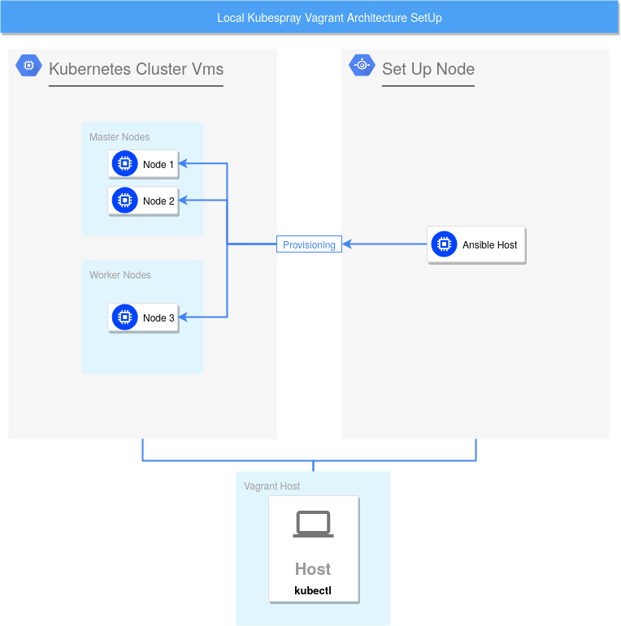

# Kubespray environment
This is a kubespray testing repository with a Vagrantfile to start asap.
4 machines (Ubuntu) are created, connected to a private network.

# Architecture
The architexture can be seen in the image below. From your host, several machines are set up with Vagrant. One of which is there to provision all Nodes. This is, so you don't need to have Ansible installed on your host.




# How to use it?

### Prerequisites
##### VM Provider
You need a virtual machine provider like virtual box.

On Ubuntu install VirtualBox via:
`sudo apt install virtual-box`

##### Vagrant
To run a cluster locally, on your machine, you will also need vagrant, to setup VMs easily.

On Ubuntu install Vagrant via:
`sudo apt install vagrant`

##### Kubernetes
Once the VM setup is done, you will need kubernetes kubectl to control your Kubernetes cluster.

On Install Kubernetes kubectl binary with curl:

1. Download the latest release with the command:
    `curl -LO https://storage.googleapis.com/kubernetes-release/release/`curl -s https://storage.googleapis.com/kubernetes-release/release/stable.txt`/bin/linux/amd64/kubectl`


    To download a specific version, replace the $(curl -s https://storage.googleapis.com/kubernetes-release/release/stable.txt) portion of the command with the specific version.

    For example, to download version v1.17.0 on Linux, type:

    curl -LO https://storage.googleapis.com/kubernetes-release/release/v1.17.0/bin/linux/amd64/kubectl

2. Make the kubectl binary executable:
    `chmod +x ./kubectl`

3. Move the binary in to your PATH:
    `sudo mv ./kubectl /usr/local/bin/kubectl`

4. Test to ensure the version you installed is up-to-date:
    `kubectl version --client`


On Ubuntu install Kubernetes kubectl via:

```
sudo apt-get update && sudo apt-get install -y apt-transport-https`
curl -s https://packages.cloud.google.com/apt/doc/apt-key.gpg | sudo apt-key add -
echo "deb https://apt.kubernetes.io/ kubernetes-xenial main" | sudo tee -a /etc/apt/sources.list.d/kubernetes.list
sudo apt-get update
sudo apt-get install -y kubectl
```


### Installation
1. Install the [prerequisites](#Prerequisites)
2. Clone this repository via git clone: `git clone git@github.com:zwoefler/Testing-Environments.git`
3. Change Directory into kubespray-test: `cd Testing-Environments/kubespray-test`
4. Run the Vagrantfile: `vagrant up`. It can take some time (several minutes) to create the machines and provisioning with ansible.

Once the infrastructure is set up, connect to the ansible-host and follow the subsequent steps. Python3, Kubespray and the dependencies are already installed.

5. `vagrant ssh ansible-host`
6. Once you are logged into the machine, change directory to kubespray `cd kubespray`
7. Copy `inventory/sample` as `inventory/mycluster`
`cp -rfp inventory/sample inventory/mycluster`
8. Declare your node IPs and then run the `declare -a IPS=(192.168.33.20 192.168.33.30 192.168.33.40)`
9. Afterwards, use the `CONFIG_FILE=inventory/mycluster/hosts.yaml python3 contrib/inventory_builder/inventory.py ${IPS[@]}` command to run the ansible inventory bilder
10. Last but not least, run the Ansible playbook that creates your kubernetes cluster via `Kubespray`: `ansible-playbook -i inventory/mycluster/hosts.yaml  --become --become-user=root cluster.yml`. This step might take more than 20 minutes!


### use your Cluster
After the setup is finished, you can use your kubernetes Cluster.
On your host-machine (Not one of the vagrant machines) get your kubernetes cluster information
1. Create, if not already done, your local `.kube`-folder: `mkdir -p ~/.kube`
2. Download the kubeconfig file from one of the masters, in this case, from `node1`: `scp root@192.168.33.20:/etc/kubernetes/admin.conf ~/.kube/config`.
3. Now you should be able to run `kubectl` commands. Try `kubectl get nodes -o wide`.
4. `kubectl cluster-info`, `kubectl -n kube-system get pods`


### Test teh interport communication
See if interport communication works by starting two `busybox` containers, each on one node.
1. Open one terminal session: `kubectl run myshell -it --rm --image busybox -- sh`
2. With `kubectl get pods -o wide` you can see in the `node`-column, where your container runs.
2. In another terminal start a seconds `budybox` via: `kubectl run myshell2 -it --rm --image busybox -- sh`


## ToDos
1. Initialize the 4 machines, 3 nodes, 1 ansible master
*. Install Ansible on the Ansible-master
*. Generate SSH Key-Pair on Ansible host
*. ssh-copy-id to remaining three nodes

- Implement a way, to vary the amount of nodes
    - Automatically adjust the amount of nodes, to the systems resources